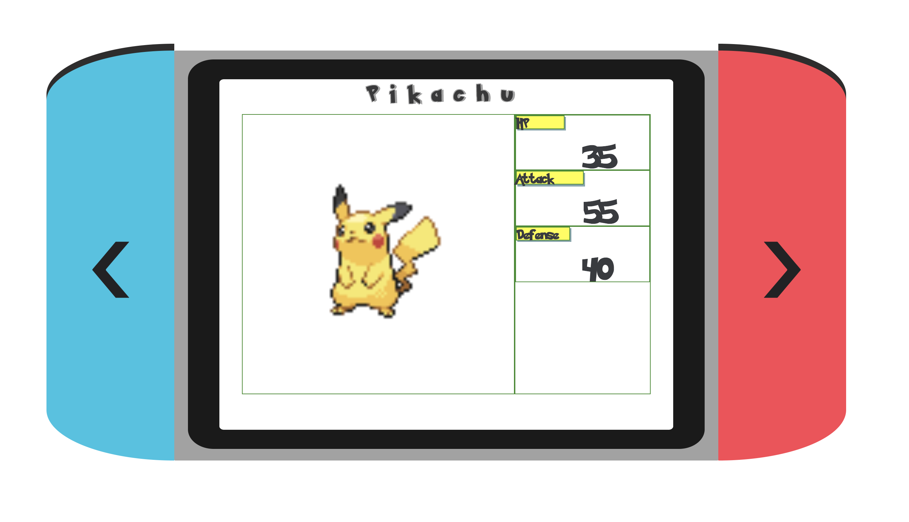

<h3> Pokemon Switch - NYCDA Web Dev Fellowship Class Project </h3>

Hey, I created a simple layout to model the Nintendo Switch where you can toggle through Pokemon and see their respective information.

You can use either your mouse or the arrow keys on your computer keyboard to toggle through the different Pokemon.

<h3> Class project prompt </h3>

Create a Personal Pokedex of 3 Pokemon that retrieves each Pokemon's stats based using the Pokemon API

<h3> Built with: </h3>

<li> HTML/Sass </li>
<li> Bootstrap </li>

<h3> Skills utilized: </h3>
<li> API requests using Axios </li>
<li> Object-Oriented Approach </li>
<li> KeyFrame Animations </li>
